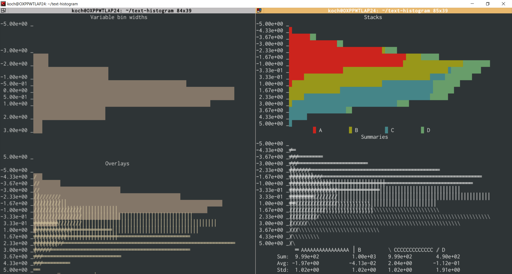

==========
histoprint
==========

|Scikit-HEP|

Pretty print Numpy (and other) histograms to the console

How does it work?
-----------------

Histoprint uses a mix of terminal color codes and Unicode trickery (i.e.
combining characters) to plot overlaying histograms. Some terminals are not
able to display Unicode combining characters correctly. Histopront can still be
used in those terminals, but the character set needs to be constrained to the
non-combining ones (see below).

Examples
--------

Some examples::

    import numpy as np
    from histoprint import text_hist, print_hist

    A = np.random.randn(1000) - 2
    B = np.random.randn(1000)
    C = np.random.randn(1000) + 2
    D = np.random.randn(500) * 2

    # text_hist is a thin wrapper for numpy.histogram
    text_hist(
        B, bins=[-5, -3, -2, -1, -0.5, 0, 0.5, 1, 2, 3, 5], title="Variable bin widths"
    )

    histA = np.histogram(A, bins=15, range=(-5, 5))
    histB = np.histogram(B, bins=15, range=(-5, 5))
    histC = np.histogram(C, bins=15, range=(-5, 5))
    histD = np.histogram(D, bins=15, range=(-5, 5))
    histAll = ([histA[0], histB[0], histC[0], histD[0]], histA[1])

    # print_hist can be used to print multiple histograms at once
    # (or just to print a single one as returned by numpy.histogram)
    print_hist(histAll, title="Overlays", labels="ABCDE")
    print_hist(
        histAll,
        title="Stacks",
        stack=True,
        symbols="      ",
        bg_colors="rgbcmy",
        labels="ABCDE",
    )
    print_hist(
        histAll,
        title="Summaries",
        symbols=r"=|\/",
        fg_colors="0",
        bg_colors="0",
        labels=["AAAAAAAAAAAAAAAA", "B", "CCCCCCCCCCCCC", "D"],
        summary=True,
    )

The last example does not use terminal colors, so it can be copied as text::

                                       Summaries
    -5.00e+00 _
    -4.33e+00 _═⃫
    -3.67e+00 _═⃫═⃫═͏═͏═͏═͏═͏═͏═͏═͏═͏═͏═͏
    -3.00e+00 _═⃫═⃫═⃫═⃫═⃫═⃫═͏═͏═͏═͏═͏═͏═͏═͏═͏═͏═͏═͏═͏═͏═͏═͏═͏═͏═͏═͏═͏═͏
    -2.33e+00 _╪⃫╪⃫═⃫═⃫═⃫═⃫═⃫═͏═͏═͏═͏═͏═͏═͏═͏═͏═͏═͏═͏═͏═͏═͏═͏═͏═͏═͏═͏═͏═͏═͏═͏═͏═͏═͏═͏═͏═͏═͏═͏═͏═͏═͏═͏═͏═͏═͏═͏═͏═͏═͏
    -1.67e+00 _╪⃫╪⃫╪⃫╪⃫╪⃫╪⃫╪⃫╪⃫╪⃫╪⃫═⃫═⃫═⃫═͏═͏═͏═͏═͏═͏═͏═͏═͏═͏═͏═͏═͏═͏═͏═͏═͏═͏═͏═͏═͏═͏═͏═͏═͏═͏═͏═͏═͏═͏═͏═͏═͏═͏═͏═͏═͏═͏═͏═͏═͏═͏═͏═͏═͏═͏═͏═͏═͏═͏═͏═͏═͏═͏
    -1.00e+00 _╪⃫╪⃫╪⃫╪⃫╪⃫╪⃫╪⃫╪⃫╪⃫╪⃫╪⃫╪⃫╪͏╪͏╪͏╪͏╪͏╪͏╪͏╪͏╪͏╪͏╪͏╪͏╪͏╪͏═͏═͏═͏═͏═͏═͏═͏═͏═͏═͏═͏═͏═͏═͏═͏═͏═͏═͏═͏═͏═͏═͏═͏═͏═͏═͏═͏
    -3.33e-01 _╪⃥⃫╪⃥⃫╪⃫╪⃫╪⃫╪⃫╪⃫╪⃫╪⃫╪⃫╪⃫╪⃫╪⃫╪⃫╪⃫╪⃫╪⃫╪͏╪͏╪͏╪͏╪͏╪͏╪͏╪͏╪͏╪͏╪͏╪͏╪͏╪͏╪͏╪͏╪͏│͏│͏│͏│͏│͏│͏│͏│͏│͏│͏│͏│͏│͏│͏│͏│͏│͏│͏│͏│͏│͏│͏│͏│͏│͏
     3.33e-01 _╪⃥⃫╪⃥⃫╪⃥⃫╪⃥⃫╪⃥⃫╪⃥⃫╪⃫╪⃫╪⃫╪⃫│⃫│⃫│⃫│⃫│⃫│͏│͏│͏│͏│͏│͏│͏│͏│͏│͏│͏│͏│͏│͏│͏│͏│͏│͏│͏│͏│͏│͏│͏│͏│͏│͏│͏│͏│͏│͏│͏│͏│͏│͏│͏│͏│͏│͏│͏│͏│͏│͏│͏│͏│͏│͏│͏│͏│͏
     1.00e+00 _╪⃥⃫│⃥⃫│⃥⃫│⃥⃫│⃥⃫│⃥⃫│⃥⃫│⃥⃫│⃥⃫│⃥⃫│⃥⃫│⃥⃫│⃥⃫│⃥⃫│⃥⃫│⃥⃫│⃥│⃥│⃥│⃥│⃥│⃥│⃥│⃥│⃥│⃥│⃥│⃥│͏│͏│͏│͏│͏│͏│͏│͏│͏│͏│͏│͏│͏│͏│͏│͏│͏│͏│͏│͏│͏│͏│͏
     1.67e+00 _│⃥⃫│⃥⃫│⃥⃫│⃥⃫│⃥⃫│⃥⃫│⃥⃫│⃥⃫│⃥⃫│⃥⃫│⃥⃫│⃥│⃥│⃥│⃥│⃥│⃥│⃥│⃥│⃥│⃥│⃥│⃥│⃥│⃥│⃥│⃥│⃥│⃥│⃥│⃥│⃥│⃥ ⃥ ⃥ ⃥ ⃥ ⃥ ⃥ ⃥ ⃥ ⃥ ⃥ ⃥ ⃥ ⃥ ⃥ ⃥ ⃥ ⃥ ⃥ ⃥ ⃥ ⃥ ⃥ ⃥ ⃥ ⃥ ⃥
     2.33e+00 _│⃥⃫│⃥⃫│⃥⃫│⃥⃫│⃥⃫│⃥⃫│⃥⃫│⃥⃫│⃥│⃥ ⃥ ⃥ ⃥ ⃥ ⃥ ⃥ ⃥ ⃥ ⃥ ⃥ ⃥ ⃥ ⃥ ⃥ ⃥ ⃥ ⃥ ⃥ ⃥ ⃥ ⃥ ⃥ ⃥ ⃥ ⃥ ⃥ ⃥ ⃥ ⃥ ⃥ ⃥ ⃥ ⃥ ⃥ ⃥ ⃥ ⃥ ⃥ ⃥ ⃥ ⃥ ⃥ ⃥ ⃥ ⃥ ⃥ ⃥ ⃥ ⃥ ⃥ ⃥ ⃥ ⃥ ⃥ ⃥ ⃥ ⃥
     3.00e+00 _│⃥⃫│⃥⃫ ⃥⃫ ⃥⃫ ⃥⃫ ⃥ ⃥ ⃥ ⃥ ⃥ ⃥ ⃥ ⃥ ⃥ ⃥ ⃥ ⃥ ⃥ ⃥ ⃥ ⃥ ⃥ ⃥ ⃥ ⃥ ⃥ ⃥ ⃥ ⃥ ⃥ ⃥ ⃥ ⃥ ⃥ ⃥ ⃥ ⃥ ⃥ ⃥ ⃥ ⃥ ⃥ ⃥ ⃥ ⃥ ⃥ ⃥ ⃥ ⃥ ⃥ ⃥ ⃥ ⃥ ⃥ ⃥
     3.67e+00 _ ⃥⃫ ⃥⃫ ⃥⃫ ⃥⃫ ⃥⃫ ⃥ ⃥ ⃥ ⃥ ⃥ ⃥ ⃥ ⃥ ⃥ ⃥ ⃥ ⃥ ⃥ ⃥ ⃥ ⃥ ⃥ ⃥ ⃥ ⃥ ⃥ ⃥
     4.33e+00 _ ⃥⃫ ⃥ ⃥ ⃥ ⃥ ⃥ ⃥ ⃥ ⃥
     5.00e+00 _ ⃥⃫ ⃥
                 ═͏ AAAAAAAAAAAAAAAA │͏ B          ⃥ CCCCCCCCCCCCC  ⃫ D
           Sum:  9.99e+02           1.00e+03    9.99e+02        4.92e+02
           Avg: -1.98e+00           1.13e-02    1.99e+00       -1.71e-01
           Std:  1.03e+00           1.03e+00    9.94e-01        2.00e+00

Command line interface
----------------------

Histoprint also comes with a simple command line interface to create histograms
of tabulated data. It can read in files or take data directly from STDIN::

    $ histoprint --help
    Usage: histoprint [OPTIONS] INFILE

      Read INFILE and print a histogram of the contained columns.

      INFILE can be '-', in which case the data is read from STDIN.

    Options:
      -b, --bins TEXT                 Number of bins or space-separated bin edges.
      -t, --title TEXT                Title of the histogram.
      --stack / --nostack             Stack the histograms.
      -s, --summary / -S, --nosummary
                                      Print summary statistics.
      -l, --label TEXT                Labels for the data, one for each column.
      --symbols TEXT                  Symbol cycle for multiple histograms.
                                      Choices & default: ' |=/\'

      --fg-colors TEXT                Colour cycle for foreground colours.
                                      Default: 'WWWWW', Choices:
                                      '0rgbcmykwRGBCMYKW'

      --bg-colors TEXT                Colour cycle for background colours.
                                      Default: 'K0000', Choices:
                                      '0rgbcmykwRGBCMYKW'

      -f, --field TEXT                Which fields to histogram. Interpretation of
                                      the fields depends on the file format. TXT
                                      files only support integers for column
                                      numbers starting at 0. For CSV files, the
                                      fields must be the names of the columns as
                                      specified in the first line of the file.
                                      When plotting from ROOT files, at least one
                                      field must be specified. This can either be
                                      the path to a single TH1, or one or more
                                      paths to TTree branches.

      --version                       Show the version and exit.
      --help                          Show this message and exit.

    $ histoprint -t "Title" -s -b "0.5 1.5 2.5 3.5 4.5" -l A -l B --fg-colors "0" --bg-colors "0" --symbols "|=" - <<EOF
    1 2
    2 3
    2 3
    2 nan
    3 4
    3 4
    EOF
                                         Title
     5.00e-01 _
               │͏│͏│͏│͏│͏│͏│͏│͏│͏│͏│͏│͏│͏│͏│͏│͏│͏│͏│͏│͏│͏│͏
               │͏│͏│͏│͏│͏│͏│͏│͏│͏│͏│͏│͏│͏│͏│͏│͏│͏│͏│͏│͏│͏│͏
               │͏│͏│͏│͏│͏│͏│͏│͏│͏│͏│͏│͏│͏│͏│͏│͏│͏│͏│͏│͏│͏│͏
     1.50e+00 _│͏│͏│͏│͏│͏│͏│͏│͏│͏│͏│͏│͏│͏│͏│͏│͏│͏│͏│͏│͏│͏│͏
               ╪͏╪͏╪͏╪͏╪͏╪͏╪͏╪͏╪͏╪͏╪͏╪͏╪͏╪͏╪͏╪͏╪͏╪͏╪͏╪͏╪͏╪͏│͏│͏│͏│͏│͏│͏│͏│͏│͏│͏│͏│͏│͏│͏│͏│͏│͏│͏│͏│͏│͏│͏│͏│͏│͏│͏│͏│͏│͏│͏│͏│͏│͏│͏│͏│͏│͏│͏│͏│͏│͏│͏│͏│͏│͏
               ╪͏╪͏╪͏╪͏╪͏╪͏╪͏╪͏╪͏╪͏╪͏╪͏╪͏╪͏╪͏╪͏╪͏╪͏╪͏╪͏╪͏╪͏│͏│͏│͏│͏│͏│͏│͏│͏│͏│͏│͏│͏│͏│͏│͏│͏│͏│͏│͏│͏│͏│͏│͏│͏│͏│͏│͏│͏│͏│͏│͏│͏│͏│͏│͏│͏│͏│͏│͏│͏│͏│͏│͏│͏│͏
               ╪͏╪͏╪͏╪͏╪͏╪͏╪͏╪͏╪͏╪͏╪͏╪͏╪͏╪͏╪͏╪͏╪͏╪͏╪͏╪͏╪͏╪͏│͏│͏│͏│͏│͏│͏│͏│͏│͏│͏│͏│͏│͏│͏│͏│͏│͏│͏│͏│͏│͏│͏│͏│͏│͏│͏│͏│͏│͏│͏│͏│͏│͏│͏│͏│͏│͏│͏│͏│͏│͏│͏│͏│͏│͏
     2.50e+00 _╪͏╪͏╪͏╪͏╪͏╪͏╪͏╪͏╪͏╪͏╪͏╪͏╪͏╪͏╪͏╪͏╪͏╪͏╪͏╪͏╪͏╪͏│͏│͏│͏│͏│͏│͏│͏│͏│͏│͏│͏│͏│͏│͏│͏│͏│͏│͏│͏│͏│͏│͏│͏│͏│͏│͏│͏│͏│͏│͏│͏│͏│͏│͏│͏│͏│͏│͏│͏│͏│͏│͏│͏│͏│͏
               ╪͏╪͏╪͏╪͏╪͏╪͏╪͏╪͏╪͏╪͏╪͏╪͏╪͏╪͏╪͏╪͏╪͏╪͏╪͏╪͏╪͏╪͏╪͏╪͏╪͏╪͏╪͏╪͏╪͏╪͏╪͏╪͏╪͏╪͏╪͏╪͏╪͏╪͏╪͏╪͏╪͏╪͏╪͏╪͏╪͏
               ╪͏╪͏╪͏╪͏╪͏╪͏╪͏╪͏╪͏╪͏╪͏╪͏╪͏╪͏╪͏╪͏╪͏╪͏╪͏╪͏╪͏╪͏╪͏╪͏╪͏╪͏╪͏╪͏╪͏╪͏╪͏╪͏╪͏╪͏╪͏╪͏╪͏╪͏╪͏╪͏╪͏╪͏╪͏╪͏╪͏
               ╪͏╪͏╪͏╪͏╪͏╪͏╪͏╪͏╪͏╪͏╪͏╪͏╪͏╪͏╪͏╪͏╪͏╪͏╪͏╪͏╪͏╪͏╪͏╪͏╪͏╪͏╪͏╪͏╪͏╪͏╪͏╪͏╪͏╪͏╪͏╪͏╪͏╪͏╪͏╪͏╪͏╪͏╪͏╪͏╪͏
     3.50e+00 _╪͏╪͏╪͏╪͏╪͏╪͏╪͏╪͏╪͏╪͏╪͏╪͏╪͏╪͏╪͏╪͏╪͏╪͏╪͏╪͏╪͏╪͏╪͏╪͏╪͏╪͏╪͏╪͏╪͏╪͏╪͏╪͏╪͏╪͏╪͏╪͏╪͏╪͏╪͏╪͏╪͏╪͏╪͏╪͏╪͏
               ═͏═͏═͏═͏═͏═͏═͏═͏═͏═͏═͏═͏═͏═͏═͏═͏═͏═͏═͏═͏═͏═͏═͏═͏═͏═͏═͏═͏═͏═͏═͏═͏═͏═͏═͏═͏═͏═͏═͏═͏═͏═͏═͏═͏═͏
               ═͏═͏═͏═͏═͏═͏═͏═͏═͏═͏═͏═͏═͏═͏═͏═͏═͏═͏═͏═͏═͏═͏═͏═͏═͏═͏═͏═͏═͏═͏═͏═͏═͏═͏═͏═͏═͏═͏═͏═͏═͏═͏═͏═͏═͏
               ═͏═͏═͏═͏═͏═͏═͏═͏═͏═͏═͏═͏═͏═͏═͏═͏═͏═͏═͏═͏═͏═͏═͏═͏═͏═͏═͏═͏═͏═͏═͏═͏═͏═͏═͏═͏═͏═͏═͏═͏═͏═͏═͏═͏═͏
     4.50e+00 _═͏═͏═͏═͏═͏═͏═͏═͏═͏═͏═͏═͏═͏═͏═͏═͏═͏═͏═͏═͏═͏═͏═͏═͏═͏═͏═͏═͏═͏═͏═͏═͏═͏═͏═͏═͏═͏═͏═͏═͏═͏═͏═͏═͏═͏
                                   │͏ A         ═͏ B
                             Tot:  6.00e+00    5.00e+00
                             Avg:  2.17e+00    3.20e+00
                             Std:  6.87e-01    7.48e-01

Support for other histogram types
---------------------------------

Histoprint can directly plot other (more fancy) types of histograms if they
offer a way of being converted to the Numpy format. Currently this means they
have to expose a ``numpy()`` or ``to_numpy()`` method. Both the ``TH1``
histograms of uproot, as well as the histograms of boost-histogram are
supported like this::

    import boost_histogram as bh
    hist = bh.Histogram(bh.axis.Regular(20, -3, 3))
    hist.fill(np.random.randn(1000))
    print_hist(hist, title="Boost Histogram")

    import uproot
    file = uproot.open("http://scikit-hep.org/uproot/examples/Event.root")
    hist = file["htime"]
    print_hist(hist, title="uproot TH1")

How to get it?
--------------

::

    $ pip install [--user] histoprint

::

    $ conda install -c conda-forge histoprint

.. |Scikit-HEP| image:: https://scikit-hep.org/assets/images/Scikit--HEP-Project-blue.svg
   :target: https://scikit-hep.org/

Disabling Unicode combining characters
--------------------------------------

Some terminals are not able to display Unicode combining characters correctly.
To disable the use of combining characters, simply do not use them when calling
``print_hist``::

    print_hist(some_histograms, symbols=" =|")

The combining characters are ``/`` and ``\``. Note that they are used in the
default set of characters for the 4th and 5th histogram if they are present.
